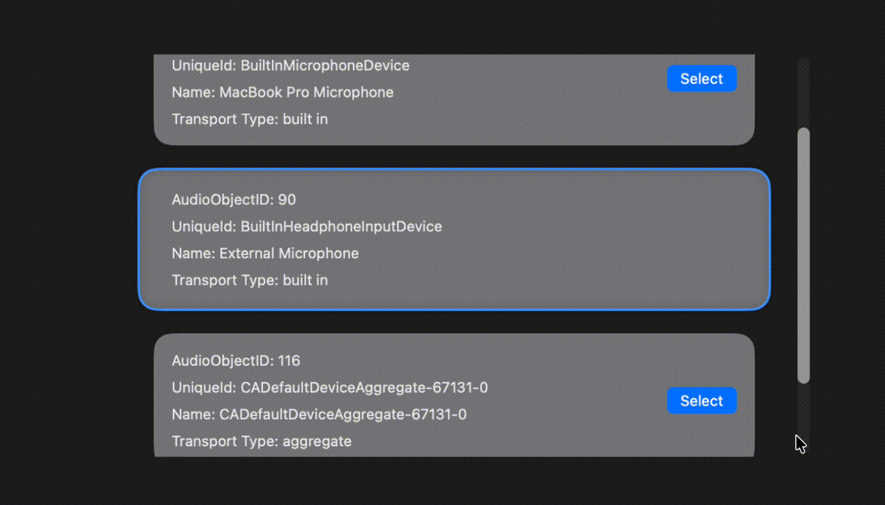

# SwiftUI_MacOS_GetSetAudioDevices-Mic-
A demo of obtaining a list of mic available on MacOS and setting those as the capture device for the recording.

For more details, please checkout my blog [SwiftUI/MacOS: Manage/Configure Audio Device (Microphone) Inputs]()

